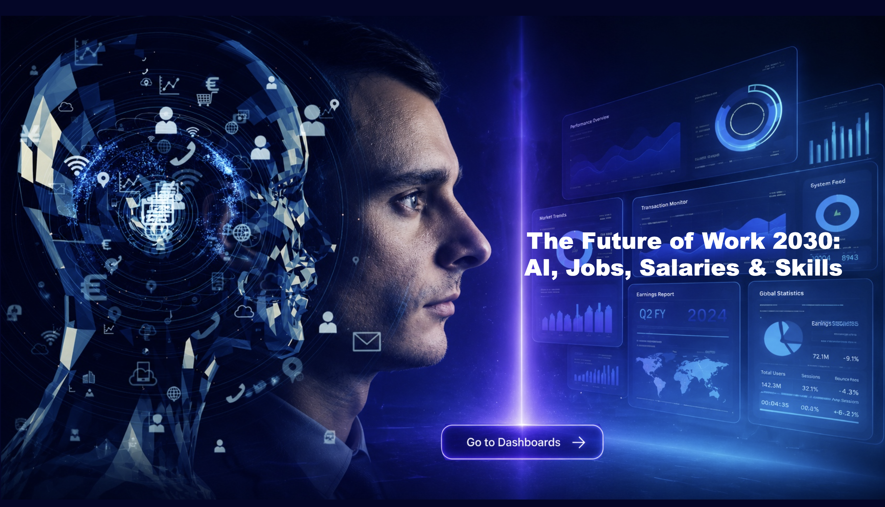
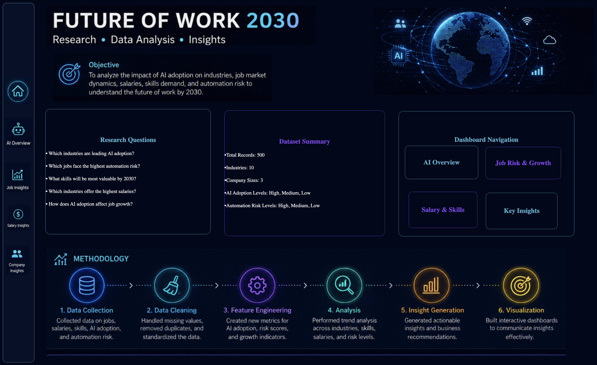
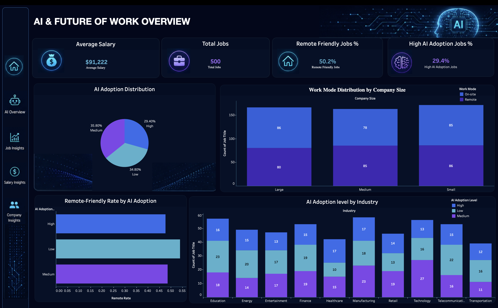
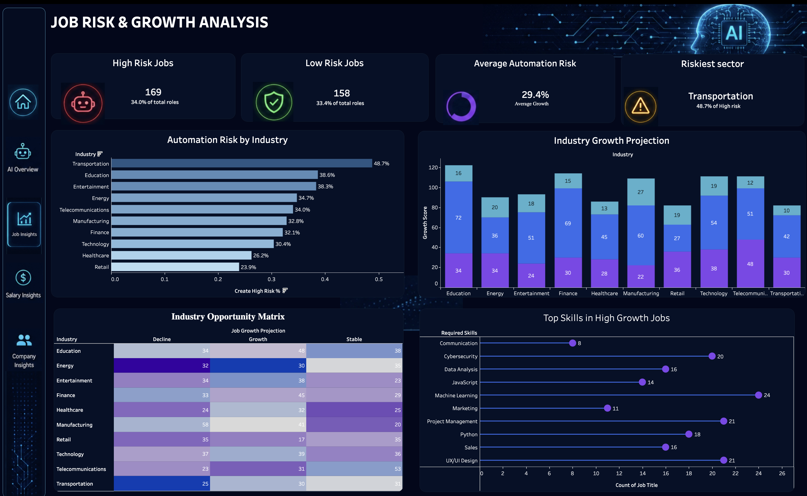
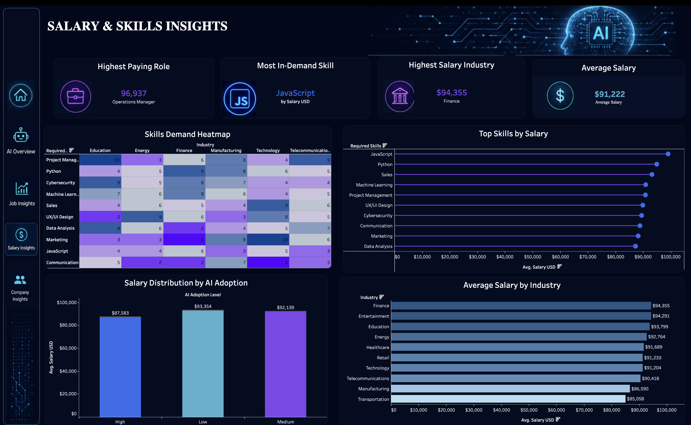
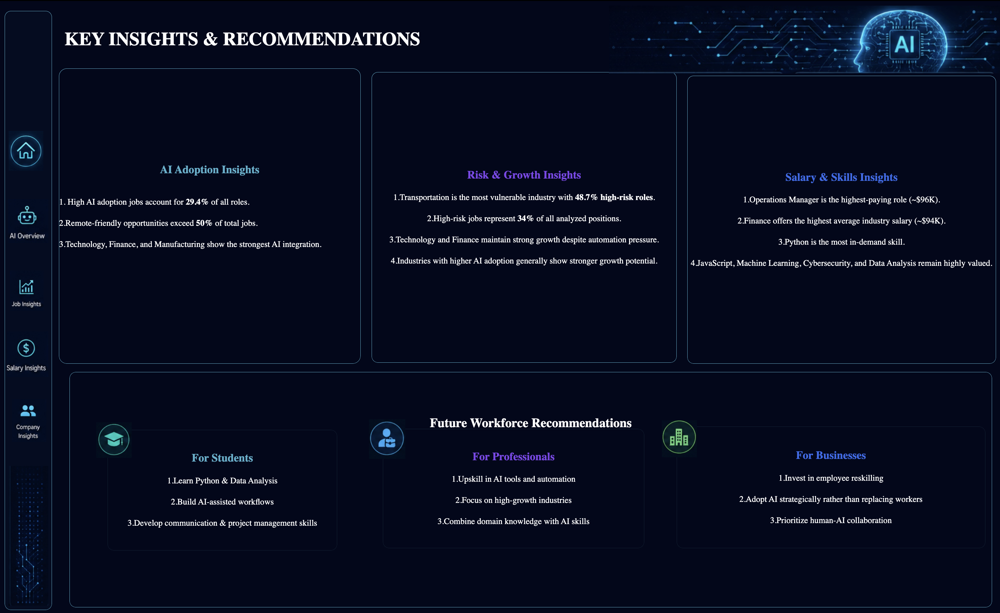

<div align="center">


# 🚀 Future of Work 2030

### **AI • Automation • Skills • Salaries • Workforce Transformation**

<p>
  <em>
    An interactive Tableau analytics project exploring how AI adoption,
    automation risk, emerging skills, salaries, and remote work are
    shaping the workforce of 2030.
  </em>
</p>

<br>

<a href="YOUR_TABLEAU_PUBLIC_LINK">
  
</a>
&nbsp;
<a href="#-key-insights">
  
</a>

<br><br>

</div>

---

## 🌍 Why This Project?

The workplace is changing rapidly.

AI is not simply creating a future where humans disappear. Instead, it is changing **which tasks are automated, which skills become valuable, and how humans collaborate with intelligent systems.**

**Future of Work 2030** uses data visualization and exploratory analytics to investigate this transformation across hundreds of job profiles and multiple industries.

### The project answers four major questions:

> 🤖 **Where is AI adoption accelerating?**

> ⚠️ **Which jobs and industries face greater automation exposure?**

> 💰 **Which roles and skillsets command higher salaries?**

> 🧠 **What skills could become increasingly valuable in an AI-driven economy?**

---

# 📊 Dashboard Overview

The Tableau project is organized into **four interconnected analytical dashboards**.

<div align="center">

|               Dashboard              | Focus                                                 |
| :----------------------------------: | :---------------------------------------------------- |
|  🤖 **01 — Research Methodology**  | Data Summary and Research Questions |
|  ⚠️ **02 —  AI Future Work Overiew**  | AI adoption, workforce distribution & industry trends               |
| 💰 **03 — Job Risk Growth Analysis** | Automation exposure vs. industry growth                   |
|    🎯 **04 — Salary Insights**    | Compensation, skills & career value                |
|     **05 - Key Insights**    | Data-driven workforce recommendations               |

</div>

---

# 🧠 Dashboard Architecture

```text
                         ┌───────────────────────────────┐
                         │       FUTURE OF WORK 2030     │
                         │       TABLEAU ANALYTICS       │
                         └───────────────┬───────────────┘
                                         │
          ┌──────────────────────────────┼──────────────────────────────┐
          │                              │                              │
          ▼                              ▼                              ▼
 ┌─────────────────┐             ┌─────────────────┐             ┌─────────────────┐
 │ 01. AI &        │             │ 02. AUTOMATION  │             │ 03. SALARY &    │
 │ WORKFORCE       │────────────▶│ RISK & GROWTH   │────────────▶│ SKILL ECONOMICS │
 │ LANDSCAPE       │             │ MATRIX          │             │                 │
 └────────┬────────┘             └────────┬────────┘             └────────┬────────┘
          │                               │                               │
          └───────────────────────────────┼───────────────────────────────┘
                                          ▼
                               ┌─────────────────────┐
                               │ 04. STRATEGIC       │
                               │ INSIGHTS & ACTIONS  │
                               └──────────┬──────────┘
                                          ▼
                               ┌─────────────────────┐
                               │ ACTIONABLE WORKFORCE│
                               │      INSIGHTS       │
                               └─────────────────────┘
```

---

# 🔎 Dashboard Deep Dive

## 01 — 🤖 AI & Modern Workforce Landscape

The first dashboard establishes the **macro view of the workforce**.

### Key Metrics

* Total job profiles analyzed
* AI adoption rate
* Workforce distribution
* Industry representation
* Remote-work availability
* Salary distribution

### Questions Explored

* Which industries are adopting AI most rapidly?
* How widespread is remote work?
* Which sectors have the largest workforce representation?
* How does AI adoption vary across industries?

---

## 02 — ⚠️ Job Automation Risk vs. Industry Growth

This dashboard examines the relationship between **automation exposure and industry growth**.

### Core Analysis

```text
                    INDUSTRY GROWTH
                          ▲
                          │
       GROWING            │            HIGH-GROWTH
       + LOW RISK         │            + HIGH RISK
                          │
 ─────────────────────────┼────────────────────────▶
                          │              AUTOMATION
       LOW-GROWTH         │            HIGH-RISK
       + LOW RISK         │
                          │
                          ▼
```

### Key Indicators

* Automation risk
* Industry growth
* AI adoption
* Job displacement
* Job creation
* Workforce exposure

This helps identify industries where **growth and disruption may occur simultaneously**.

---

## 03 — 💰 Compensation & Skillset Economics

Not all skills are valued equally.

This dashboard investigates how **skills, AI adoption, and job characteristics interact with compensation.**

### Analyzed Factors

| Factor         | Question                                      |
| -------------- | --------------------------------------------- |
| 💰 Salary      | Which roles command higher compensation?      |
| 🧠 Skills      | Which skills appear across high-paying roles? |
| 🤖 AI Adoption | Does AI exposure correlate with compensation? |
| 🌎 Remote Work | Which high-value roles support remote work?   |
| 📈 Experience  | How does experience relate to earnings?       |

---

## 04 — 🎯 Strategic Workforce Insights

The final dashboard converts analysis into **practical insights for students, professionals, recruiters, and organizations.**

### Strategic Themes

**For Students & Professionals**

* Build AI literacy
* Develop technical + human skills
* Focus on emerging skill combinations
* Understand industry-specific automation exposure

**For Organizations**

* Identify roles exposed to automation
* Invest in workforce upskilling
* Combine human expertise with AI capabilities
* Prepare talent strategies for emerging roles

---

# 📌 Key Insights

<div align="center">

### 📊 At a Glance

| Metric                          |       Value |
| ------------------------------- | ----------: |
| 💼 Job Profiles                 |    **500+** |
| 🏭 Industries                   |      **10** |
| 🤖 High AI Adoption             |   **29.4%** |
| ⚠️ High Automation Risk         |     **34%** |
| 🌎 Remote-Friendly Roles        |   **50.2%** |
| 💰 Average Salary               | **$91,222** |
| 📈 Highest Observed Role Salary | **$96,937** |

</div>

---

# 💡 Major Findings

### 01 — AI adoption is becoming a workforce-level phenomenon

AI adoption is no longer limited to purely technical roles. Multiple industries show varying levels of AI integration, creating new requirements for digital and analytical capabilities.

### 02 — Automation risk differs significantly by industry

Some sectors demonstrate considerably greater exposure to automation than others, highlighting the importance of **industry-specific workforce planning**.

### 03 — Skills matter alongside job titles

Compensation patterns suggest that understanding **which skills accompany higher-value roles** can be as important as looking at job titles alone.

### 04 — Remote work expands the talent landscape

A significant portion of the analyzed roles show remote-work compatibility, potentially expanding access to global talent markets.

---

# 🔬 Data & Methodology

## Dataset

The analysis is based on a dataset containing **500+ job profiles across 10 industries**.

### Core Variables

```text
Job Role
    │
    ├── Industry
    ├── Salary
    ├── AI Adoption
    ├── Automation Risk
    ├── Remote Work
    ├── Skills
    ├── Job Growth
    ├── Job Creation
    └── Job Displacement
```

### Analytical Workflow

```text
Raw Dataset
     │
     ▼
Data Cleaning
     │
     ▼
Exploratory Analysis
     │
     ▼
Feature & KPI Creation
     │
     ▼
Tableau Visualizations
     │
     ▼
Interactive Dashboards
     │
     ▼
Strategic Insights
```

---

# 🛠️ Tools & Technologies

<div align="center">


</div>

### Technology Stack

| Technology     | Purpose                                  |
| -------------- | ---------------------------------------- |
| 📊 **Tableau** | Dashboard design & interactive analytics |
| 🐍 **Python**  | Data preprocessing & exploration         |

---

# 📁 Project Structure

```text
Future-of-Work-2030/
│
├── 📂 Dashboards/
│   ├── project-cover.png
│   ├── ai-future-work-overview.png
│   ├── job-risk-growth-analysis.png
│   ├── salary-skills-insights.png
│   ├── key-insights-recommendations.png
│   └── research-methodology.png
│
├── 📄 README.md
```

---

# 🖥️ Dashboard Preview

<div align="center">

### 🚀 The Future Work 2030



<br><br>

###  Research Methodology



<br><br>

### 🤖 AI Future Work Overiew



<br><br>

### ⚠️ Job Risk Growth Analysis



<br><br>

### 💰 Salary Insights



<br><br>

### 🎯 Key Insights



</div>

---

# 🚀 Explore the Dashboard

<div align="center">

<a href="YOUR_TABLEAU_PUBLIC_LINK">


</a>

<br>

**Filter • Explore • Compare • Discover**

</div>

---

# 🎓 What I Learned

This project helped strengthen my understanding of:

* 📊 Data storytelling
* 📈 Business intelligence
* 🎨 Dashboard UX/UI
* 🔍 Exploratory data analysis
* 🧮 KPI development
* 🤖 AI & workforce analytics
* 🧠 Strategic interpretation of data
* 📐 Tableau calculated fields
* 🎯 Turning raw data into actionable insights

---

# 🔮 Future Improvements

This project can be extended by incorporating:

* [ ] 📅 Historical workforce trend analysis
* [ ] 🤖 AI-powered job-risk prediction
* [ ] 🧠 Skill-demand forecasting
* [ ] 💼 Real-time job-market data
* [ ] 🌍 Country-level workforce comparison
* [ ] 📈 Machine-learning-based salary prediction
* [ ] 🔄 Automated dataset updates
* [ ] 🗺️ Global workforce opportunity map

---

# 🌟 Project Highlights

<div align="center">

<table>
<tr>
<td align="center">📊<br><b>500+</b><br><sub>Job Profiles</sub></td>
<td align="center">🏭<br><b>10</b><br><sub>Industries</sub></td>
<td align="center">🤖<br><b>AI</b><br><sub>Adoption Analysis</sub></td>
<td align="center">⚠️<br><b>Risk</b><br><sub>Automation Analysis</sub></td>
<td align="center">💰<br><b>Salary</b><br><sub>Compensation Analysis</sub></td>
</tr>
</table>

</div>

---

# ⭐ Support

If you found this project interesting:

**⭐ Star the repository**
**🍴 Fork the project**
**💬 Share your feedback**
**🔗 Explore the Tableau dashboard**

Every star and piece of feedback helps improve future analytics projects.

---

<div align="center">

### 🚀 **The future of work isn't just about automation.**

### **It's about how humans and AI work together.**

<br>


</div>
